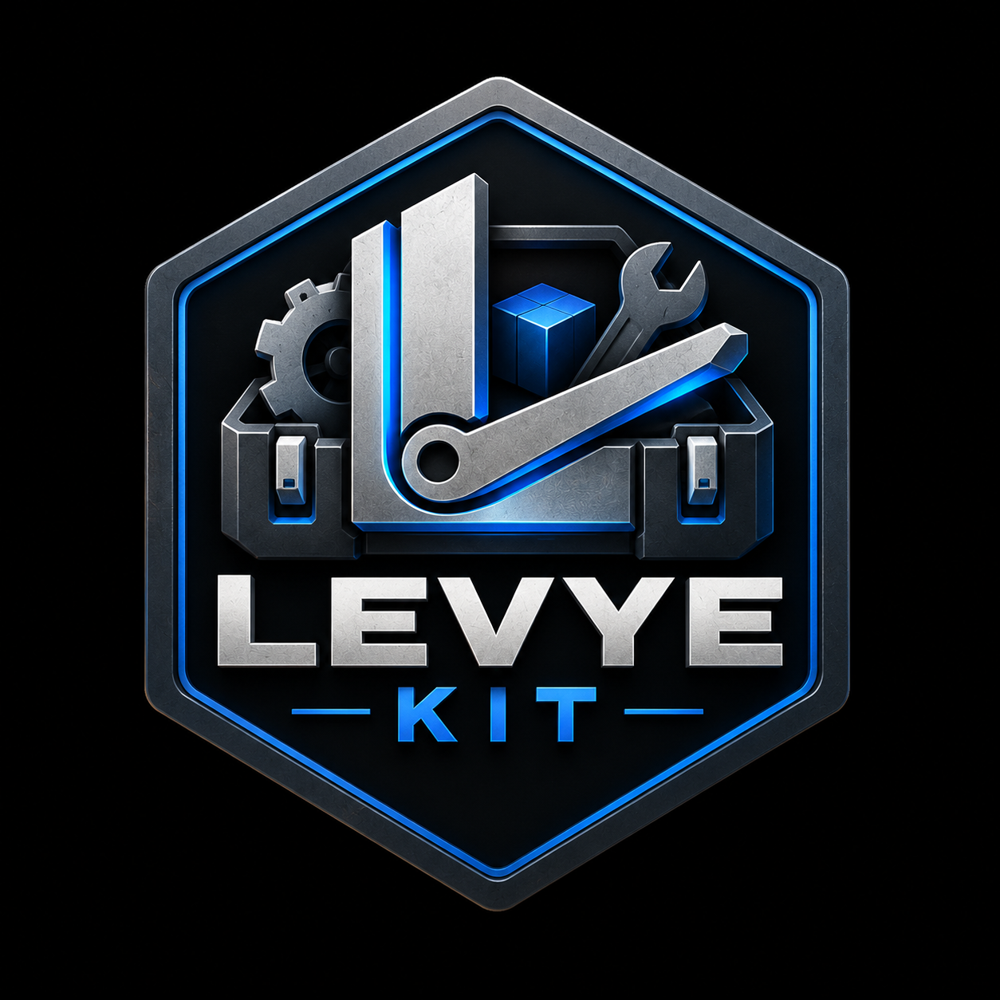

<a id="readme-top"></a>

<!-- PROJECT SHIELDS -->

[![Contributors][contributors-shield]][contributors-url]
[![Forks][forks-shield]][forks-url]
[![Stargazers][stars-shield]][stars-url]
[![Issues][issues-shield]][issues-url]

<!-- PROJECT LOGO -->

<br />

<div align="center">
  <a href="https://github.com/Levye-Studio/LevyeKit">
    
  </a>

  <h3 align="center">LevyeKit</h3>

  <p align="center">
    A lightweight C++ game framework built on raylib for Levye Studio games.
    <br />
    <a href="#usage-api"><strong>Explore the docs »</strong></a>
    <br />
    <br />
    <a href="#getting-started">Get Started</a>
    &middot;
    <a href="https://github.com/Levye-Studio/LevyeKit/issues/new?labels=bug">Report Bug</a>
    &middot;
    <a href="https://github.com/Levye-Studio/LevyeKit/issues/new?labels=enhancement">Request Feature</a>
  </p>
</div>

<!-- TABLE OF CONTENTS -->

<details>
  <summary>Table of Contents</summary>
  <ol>
    <li>
      <a href="#about-the-project">About The Project</a>
      <ul>
        <li><a href="#built-with">Built With</a></li>
        <li><a href="#design-philosophy">Design Philosophy</a></li>
      </ul>
    </li>
    <li>
      <a href="#getting-started">Getting Started</a>
      <ul>
        <li><a href="#prerequisites">Prerequisites</a></li>
        <li><a href="#installation">Installation</a></li>
      </ul>
    </li>
    <li>
      <a href="#usage-api">Usage API</a>
      <ul>
        <li><a href="#architecture">Architecture</a></li>
        <li><a href="#game-api">Game API</a></li>
        <li><a href="#hot-reloading">Hot Reloading</a></li>
        <li><a href="#state-preservation">State Preservation</a></li>
        <li><a href="#raylib-access">raylib Access</a></li>
        <li><a href="#repository-layout">Repository Layout</a></li>
      </ul>
    </li>
    <li><a href="#platforms">Platforms</a></li>
    <li><a href="#roadmap">Roadmap</a></li>
    <li><a href="#contributing">Contributing</a></li>
    <li><a href="#license">License</a></li>
    <li><a href="#contact">Contact</a></li>
  </ol>
</details>

<!-- ABOUT THE PROJECT -->

## About The Project

LevyeKit is a lightweight C++ game development framework built on top of [raylib](https://www.raylib.com/).

It is being developed as the reusable foundation for games made by **Levye Studio**.

The goal is not to replace raylib or become another large game engine. LevyeKit handles the common project infrastructure that would otherwise need to be recreated for every game while keeping raylib directly accessible to game code.

LevyeKit is designed to provide reusable systems such as:

* Application lifecycle
* Native C++ game modules
* Code hot reloading
* Persistent game state
* Input management
* Asset management
* Audio management
* Shader management
* Screen management
* Cross-platform project infrastructure

The framework stays intentionally small so games can use raylib directly whenever it already provides the required functionality.

> **Status:** Early development. The API and architecture may change while the framework evolves.

<p align="right">(<a href="#readme-top">back to top</a>)</p>

### Built With

* [![C++][C++-shield]][C++-url]
* [raylib](https://www.raylib.com/)
* [CMake](https://cmake.org/)

<p align="right">(<a href="#readme-top">back to top</a>)</p>

### Design Philosophy

LevyeKit should stay small.

If raylib already provides something cleanly, LevyeKit should generally use it rather than wrapping it unnecessarily.

The framework exists to solve repeated infrastructure problems across Levye Studio games, not to hide the underlying technology.

Its main goals are:

* Keep raylib directly accessible
* Avoid repeating project setup for every game
* Provide a reusable application lifecycle
* Support native C++ hot reloading during development
* Preserve game state across code reloads where possible
* Provide reusable input, audio, asset, shader, and screen systems
* Support desktop and mobile platforms
* Make creating a new Levye game fast
* Keep the framework understandable

<p align="right">(<a href="#readme-top">back to top</a>)</p>

<!-- GETTING STARTED -->

## Getting Started

### Prerequisites

LevyeKit currently requires:

* Git
* CMake
* A C++20 compatible compiler

Platform-specific development tools may also be required depending on the target platform.

### Installation

Clone the repository:

```sh
git clone https://github.com/Levye-Studio/LevyeKit.git
cd LevyeKit
```

Configure a debug build:

```sh
cmake -S . -B Build -DCMAKE_BUILD_TYPE=Debug
```

Build:

```sh
cmake --build Build -j
```

Run the Sandbox:

```sh
./Targets/Debug/bin/Sandbox
```

The Sandbox application is used to test LevyeKit systems and the dynamically reloadable game module.

<p align="right">(<a href="#readme-top">back to top</a>)</p>

<!-- USAGE API -->

## Usage API

### Architecture

LevyeKit separates the long-running application host from game-specific code.

```text
                 LevyeHost
                     |
                     v
              +-------------+
              |  LevyeKit   |
              |             |
              | Window      |
              | Main Loop   |
              | Input       |
              | Assets      |
              | Audio       |
              | Shaders     |
              | Screens     |
              | Hot Reload  |
              +------+------+
                     |
                  GameAPI
                     |
                     v
              +-------------+
              | Game Module |
              |             |
              | Gameplay    |
              | Screens     |
              | Entities    |
              | Game Logic  |
              +-------------+
                     |
                     v
                 Game.dylib
                 Game.so
                 Game.dll
```

The host owns the application lifecycle and remains running while game-specific code can be rebuilt and replaced during development.

<p align="right">(<a href="#readme-top">back to top</a>)</p>

### Game API

LevyeKit communicates with game code through a small API boundary.

A game module implements callbacks such as:

```cpp
void OnLoad(Levye::GameState* state);
void OnUpdate(Levye::GameState* state, float deltaTime);
void OnDraw(Levye::GameState* state);
void OnUnload(Levye::GameState* state);
```

The game module exposes a C-compatible entry point:

```cpp
extern "C" Levye::GameAPI GetGameAPI();
```

Using `extern "C"` gives the exported function a predictable symbol name that can be located by LevyeKit's dynamic-library loader.

This keeps the game code separate from the host executable while maintaining a small interface between the two.

<p align="right">(<a href="#readme-top">back to top</a>)</p>

### Hot Reloading

Native C++ hot reloading is a core part of LevyeKit's architecture.

During development, game code is compiled into a shared library:

| Platform | Game Module  |
| -------- | ------------ |
| macOS    | `Game.dylib` |
| Linux    | `Game.so`    |
| Windows  | `Game.dll`   |

The intended development loop is:

```text
Start game
    |
    v
LevyeHost opens the raylib window
    |
    v
Load Game module
    |
    v
Game running
    |
    +---- Edit game code
    |
    +---- Rebuild Game module
    |
    v
LevyeKit detects the change
    |
    v
Unload old game code
    |
    v
Load new game code
    |
    v
Continue running
```

The application and raylib window remain alive while the replaceable game code is reloaded.

This makes it possible to iterate on gameplay code without restarting the entire application after every change.

<p align="right">(<a href="#readme-top">back to top</a>)</p>

### State Preservation

Game code and game state are deliberately separated.

```text
LevyeHost
    |
    +---- GameState      <- remains alive
    |
    +---- Game.dylib     <- replaceable
```

The host owns persistent state while executable game code lives inside the dynamically loaded module.

This allows LevyeKit to replace game functions while preserving compatible runtime state across reloads.

The state system will continue to evolve as the framework develops.

<p align="right">(<a href="#readme-top">back to top</a>)</p>

### raylib Access

LevyeKit does not attempt to hide raylib behind another rendering API.

Game modules can use normal raylib functions directly:

```cpp
void OnDraw(Levye::GameState* state)
{
    ClearBackground(BLACK);

    DrawText(
        "Hello from LevyeKit!",
        40,
        40,
        32,
        RAYWHITE
    );
}
```

LevyeKit manages the outer application lifecycle while the game remains in control of its rendering and behavior.

The host manages frame boundaries:

```cpp
BeginDrawing();

game.OnDraw();

EndDrawing();
```

This keeps LevyeKit lightweight while preserving the simplicity of raylib.

<p align="right">(<a href="#readme-top">back to top</a>)</p>

### Repository Layout

The repository is organized around the framework, game modules, examples, and platform support.

```text
LevyeKit/
├── Levye/
│   ├── Assets/
│   ├── Audio/
│   ├── Core/
│   ├── Graphics/
│   ├── HotReload/
│   ├── IO/
│   ├── Input/
│   └── Screen/
│
├── Examples/
│   └── Sandbox/
│
├── .vscode/
├── CMakeLists.txt
└── README.md
```

`Levye/` contains the reusable framework.

`Examples/Sandbox/` provides a small application for testing LevyeKit and its game-module architecture.

The repository structure will continue to evolve as additional systems and platform support are added.

<p align="right">(<a href="#readme-top">back to top</a>)</p>

<!-- PLATFORMS -->

## Platforms

LevyeKit is intended to provide a common foundation across desktop and mobile targets.

| Platform | Target  |
| -------- | ------- |
| macOS    | Desktop |
| Linux    | Desktop |
| Windows  | Desktop |
| iOS      | Mobile  |
| Android  | Mobile  |

Native code hot reloading is primarily intended for desktop development.

Mobile platforms may use a different development workflow because of platform restrictions around dynamically replacing executable code.

<p align="right">(<a href="#readme-top">back to top</a>)</p>

<!-- ROADMAP -->

## Roadmap

* [x] CMake project
* [x] raylib integration
* [x] Application lifecycle
* [x] Game API boundary
* [x] Dynamic library loading
* [x] GameModule abstraction
* [x] Native game-module hot reload
* [x] Persistent host-owned game state
* [x] File watching
* [x] Input system
* [x] Audio system
* [x] Texture management
* [x] Shader management
* [x] Screen management
* [ ] Expand asset hot reloading
* [ ] Improve failed-reload recovery
* [ ] Complete Windows support
* [ ] Complete Linux support
* [ ] Complete iOS support
* [ ] Android support
* [ ] Game project templates
* [ ] `levye new <GameName>` project generator

See the [open issues][issues-url] for proposed features and reported bugs.

<p align="right">(<a href="#readme-top">back to top</a>)</p>

<!-- CONTRIBUTING -->

## Contributing

LevyeKit is still evolving, so focused contributions and bug reports are welcome.

1. Fork the project.
2. Create a branch for your change.
3. Build and test the Sandbox.
4. Keep changes focused on the framework's lightweight design.
5. Open a pull request against `main`.

For bugs, include steps to reproduce the issue and describe the platform and build configuration used.

<p align="right">(<a href="#readme-top">back to top</a>)</p>

<!-- LICENSE -->

## License

License to be determined.

Third-party libraries used by LevyeKit retain their respective licenses.

<p align="right">(<a href="#readme-top">back to top</a>)</p>

<!-- CONTACT -->

## Contact

[Levye Studio](https://github.com/Levye-Studio)

Project: [LevyeKit](https://github.com/Levye-Studio/LevyeKit)

For bugs and feature requests, use the [issue tracker][issues-url].

<p align="right">(<a href="#readme-top">back to top</a>)</p>

<!-- ACKNOWLEDGMENTS -->

## Acknowledgments

* [raylib](https://www.raylib.com/) and its contributors
* [CMake](https://cmake.org/)
* The maintainers of LevyeKit's third-party dependencies
* [Best-README-Template](https://github.com/othneildrew/Best-README-Template) for the README layout
* [Shields.io](https://shields.io/) for the badges

<p align="right">(<a href="#readme-top">back to top</a>)</p>

<!-- MARKDOWN LINKS & IMAGES -->

[contributors-shield]: https://img.shields.io/github/contributors/Levye-Studio/LevyeKit.svg?style=for-the-badge
[contributors-url]: https://github.com/Levye-Studio/LevyeKit/graphs/contributors
[forks-shield]: https://img.shields.io/github/forks/Levye-Studio/LevyeKit.svg?style=for-the-badge
[forks-url]: https://github.com/Levye-Studio/LevyeKit/forks
[stars-shield]: https://img.shields.io/github/stars/Levye-Studio/LevyeKit.svg?style=for-the-badge
[stars-url]: https://github.com/Levye-Studio/LevyeKit/stargazers
[issues-shield]: https://img.shields.io/github/issues/Levye-Studio/LevyeKit.svg?style=for-the-badge
[issues-url]: https://github.com/Levye-Studio/LevyeKit/issues
[C++-shield]: https://img.shields.io/badge/C%2B%2B-00599C?style=for-the-badge&logo=cplusplus&logoColor=white
[C++-url]: https://isocpp.org/
