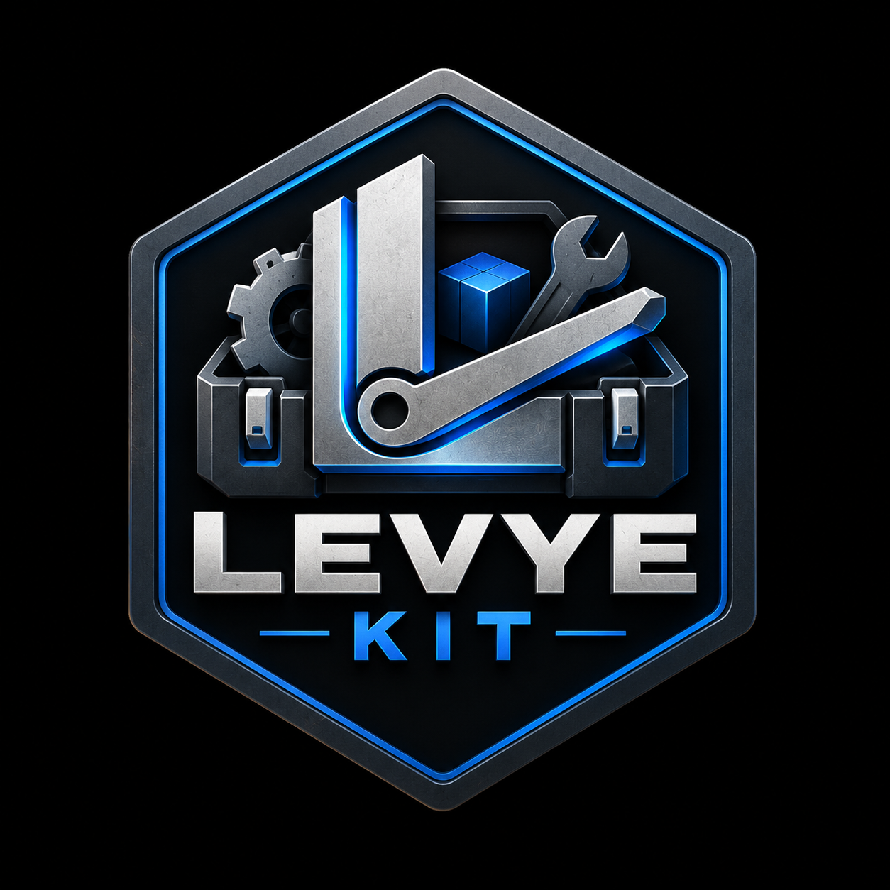
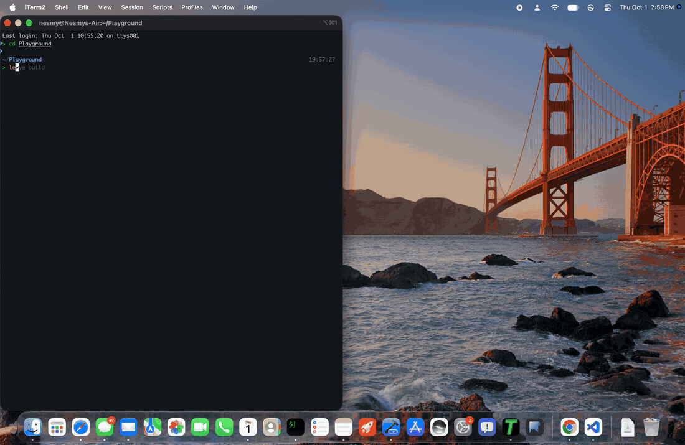
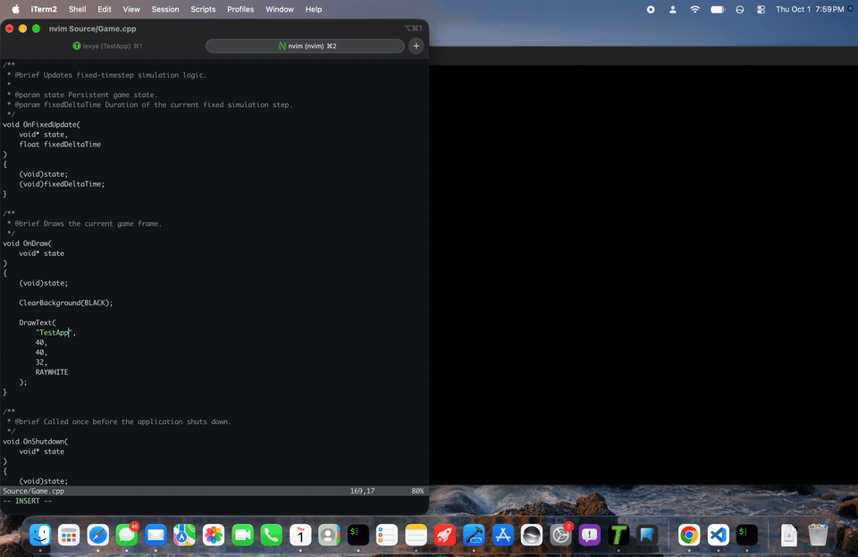

<a id="readme-top"></a>

<!-- PROJECT SHIELDS -->

[![Contributors][contributors-shield]][contributors-url]
[![Forks][forks-shield]][forks-url]
[![Stargazers][stars-shield]][stars-url]
[![Issues][issues-shield]][issues-url]

<!-- PROJECT LOGO -->

<br />

<div align="center">
  <a href="https://github.com/Levye-Studio/LevyeKit">
    
  </a>

  <h3 align="center">LevyeKit</h3>

  <p align="center">
    A lightweight C++ game framework built on raylib for Levye Studio games.
    <br />
    <a href="#usage-api"><strong>Explore the docs »</strong></a>
    <br />
    <br />
    <a href="#getting-started">Get Started</a>
    &middot;
    <a href="https://github.com/Levye-Studio/LevyeKit/issues/new?labels=bug">Report Bug</a>
    &middot;
    <a href="https://github.com/Levye-Studio/LevyeKit/issues/new?labels=enhancement">Request Feature</a>
  </p>
</div>

<!-- TABLE OF CONTENTS -->

<details>
  <summary>Table of Contents</summary>
  <ol>
    <li>
      <a href="#about-the-project">About The Project</a>
      <ul>
        <li><a href="#built-with">Built With</a></li>
        <li><a href="#design-philosophy">Design Philosophy</a></li>
      </ul>
    </li>
    <li><a href="#showcase">Showcase</a></li>
    <li>
      <a href="#getting-started">Getting Started</a>
      <ul>
        <li><a href="#prerequisites">Prerequisites</a></li>
        <li><a href="#installation">Installation</a></li>
        <li><a href="#creating-a-game">Creating a Game</a></li>
      </ul>
    </li>
    <li>
      <a href="#levye-cli">Levye CLI</a>
    </li>
    <li>
      <a href="#usage-api">Usage API</a>
      <ul>
        <li><a href="#public-api">Public API</a></li>
        <li><a href="#architecture">Architecture</a></li>
        <li><a href="#game-api">Game API</a></li>
        <li><a href="#hot-reloading">Hot Reloading</a></li>
        <li><a href="#state-preservation">State Preservation</a></li>
        <li><a href="#raylib-access">raylib Access</a></li>
        <li><a href="#repository-layout">Repository Layout</a></li>
      </ul>
    </li>
    <li><a href="#platforms">Platforms</a></li>
    <li><a href="#roadmap">Roadmap</a></li>
    <li><a href="#contributing">Contributing</a></li>
    <li><a href="#license">License</a></li>
    <li><a href="#contact">Contact</a></li>
  </ol>
</details>

<!-- ABOUT THE PROJECT -->

## About The Project

LevyeKit is a lightweight C++ game development framework built on top of [raylib](https://www.raylib.com/).

It is being developed as the reusable foundation for games made by **Levye Studio**.

The goal is not to replace raylib or become another large game engine. LevyeKit handles the common project infrastructure that would otherwise need to be recreated for every game while keeping raylib directly accessible to game code.

LevyeKit provides reusable systems for:

* Application lifecycle
* Native C++ game modules
* Code hot reloading
* Persistent game state
* Input management
* Texture, shader, and font management
* Asset hot reloading
* Audio and music management
* Screen management
* Time and fixed-step simulation
* Project configuration
* Debug and Release configurations
* Project generation
* Command-line development workflow

The framework stays intentionally small so games can use raylib directly whenever it already provides the required functionality.

> **Status:** LevyeKit `v0.1` is the first game-ready development milestone. The framework is still evolving and APIs may change in future releases.

<p align="right">(<a href="#readme-top">back to top</a>)</p>

### Built With

* [![C++][C++-shield]][C++-url]
* [raylib](https://www.raylib.com/)
* [CMake](https://cmake.org/)

<p align="right">(<a href="#readme-top">back to top</a>)</p>

### Design Philosophy

LevyeKit should stay small.

If raylib already provides something cleanly, LevyeKit should generally use it rather than wrapping it unnecessarily.

The framework exists to solve repeated infrastructure problems across Levye Studio games, not to hide the underlying technology.

Its main goals are:

* Keep raylib directly accessible
* Avoid repeating project setup for every game
* Provide a reusable application lifecycle
* Support native C++ hot reloading during development
* Preserve game state across compatible code reloads
* Keep resources owned by the stable application host
* Provide reusable input, audio, asset, shader, font, screen, and time systems
* Make creating and running a new game fast
* Keep the framework understandable
* Add systems only when games actually need them

LevyeKit deliberately avoids trying to become a full editor-driven engine.

<p align="right">(<a href="#readme-top">back to top</a>)</p>

<!-- SHOWCASE -->

## Showcase

### Sandbox Demo



### Hot Reload Demo



<p align="right">(<a href="#readme-top">back to top</a>)</p>

<!-- GETTING STARTED -->

## Getting Started

### Prerequisites

LevyeKit currently requires:

* Git
* CMake
* A C++20 compatible compiler

Platform-specific development tools may also be required depending on the target platform.

### Installation

Clone the repository:

```sh
git clone https://github.com/Levye-Studio/LevyeKit.git
cd LevyeKit
```

Configure a Debug build:

```sh
cmake -S . -B Build/Debug -DCMAKE_BUILD_TYPE=Debug
```

Build LevyeKit and its development tools:

```sh
cmake --build Build/Debug
```

The development CLI is built as:

```text
levye
```

Check the installed version:

```sh
levye --version
```

Or view the available commands:

```sh
levye --help
```

The included Sandbox can also be used to test framework systems and hot reloading.

<p align="right">(<a href="#readme-top">back to top</a>)</p>

### Creating a Game

Create a new LevyeKit game:

```sh
levye new MyGame
```

Create one and initialize a Git repository:

```sh
levye new MyGame --git
```

Or initialize Git and create the first commit:

```sh
levye new MyGame --commit
```

Then enter the generated project:

```sh
cd MyGame
```

Build it:

```sh
levye build
```

Run it:

```sh
levye run
```

A generated project contains the basic structure required to immediately start writing game code:

```text
MyGame/
├── Assets/
├── Source/
│   ├── Game.cpp
│   └── Main.cpp
├── .gitignore
├── CMakeLists.txt
└── levye.project
```

Game-specific settings such as the project name, target, window configuration, and asset directory are stored in `levye.project`.

<p align="right">(<a href="#readme-top">back to top</a>)</p>

<!-- LEVYE CLI -->

## Levye CLI

LevyeKit includes a small command-line tool for the normal game-development workflow.

```text
levye new <name> [options]
levye build [options]
levye run [options]
levye clean [options]
levye project

levye --help
levye --version
```

### Create

```sh
levye new MyGame
```

Optional Git integration:

```sh
levye new MyGame --git
levye new MyGame --commit
```

### Build

Debug is the default configuration:

```sh
levye build
```

For Release:

```sh
levye build --release
```

### Run

Run an existing Debug build:

```sh
levye run
```

Or Release:

```sh
levye run --release
```

`levye run` does not implicitly rebuild the game. Build and run remain separate operations.

### Clean

Clean Debug output:

```sh
levye clean
```

Clean Release:

```sh
levye clean --release
```

Clean all generated build configurations:

```sh
levye clean --all
```

### Project

Display information about the current project:

```sh
levye project
```

The CLI searches parent directories for `levye.project`, allowing commands to be used from directories inside a game project.

Command-specific help is also available:

```sh
levye new --help
levye build --help
levye run --help
levye clean --help
levye project --help
```

<p align="right">(<a href="#readme-top">back to top</a>)</p>

<!-- USAGE API -->

## Usage API

### Public API

Game code can include the main LevyeKit header:

```cpp
#include <Levye/LevyeKit.hpp>
```

The primary game-facing APIs are:

```cpp
Levye::Log
Levye::Input
Levye::Screen
Levye::Time
Levye::Assets
Levye::Audio
```

For example:

```cpp
Levye::Log::Info("Game started.");

if (Levye::Input::IsPressed("Action"))
{
    // Handle the action.
}

Levye::Screen::Set("Gameplay");

Levye::Time::SetPaused(false);
```

Assets are represented by lightweight handles while the actual resources remain owned by the host:

```cpp
Levye::AssetHandle texture =
    Levye::Assets::LoadTexture("player.png");

const Texture2D* player =
    Levye::Assets::GetTexture(texture);
```

Audio follows the same model:

```cpp
Levye::AssetHandle sound =
    Levye::Audio::LoadSound("click.wav");

Levye::Audio::PlaySound(sound);
```

Individual LevyeKit headers remain available when a game prefers narrower includes.

### Input

Register bindings through the public `Levye::Input` API in `OnLoad()`. The
host owns the input map; reloadable modules access it only through
`HostServices`.

```cpp
// Multiple keyboard keys and a controller button represent one action.
Levye::Input::BindKey("Jump", KEY_SPACE);
Levye::Input::BindKey("Jump", KEY_UP);
Levye::Input::BindGamepadButton("Jump", 0, GAMEPAD_BUTTON_RIGHT_FACE_DOWN);

// WASD, arrow keys, and the first controller's left stick.
Levye::Input::BindKeyAxis("MoveX", KEY_A, KEY_D);
Levye::Input::BindKeyAxis("MoveX", KEY_LEFT, KEY_RIGHT);
Levye::Input::BindKeyAxis("MoveY", KEY_W, KEY_S);
Levye::Input::BindKeyAxis("MoveY", KEY_UP, KEY_DOWN);
Levye::Input::BindGamepadAxis("MoveX", 0, GAMEPAD_AXIS_LEFT_X, 0.15f);
Levye::Input::BindGamepadAxis("MoveY", 0, GAMEPAD_AXIS_LEFT_Y, 0.15f);
```

Actions use the combined state of every bound key and gamepad button:

- `IsDown()` is true while at least one binding is held.
- `IsPressed()` is true only when the action changes from up to down.
- `IsReleased()` is true only when the last held binding is released.

For W and UP bound to the same action: pressing W triggers one press, pressing
UP while W is held does not trigger another, releasing W while UP is held does
not release the action, and releasing UP finally triggers a release. A gamepad
button participates in exactly the same way. Disconnecting a gamepad removes
its contribution; reconnecting a held button may produce a new press.

The host calls `InputMap::Update()` once per frame, after raylib's event polling
and before reload callbacks, `OnUpdate`, fixed updates, and drawing. Queries
read one snapshot and never consume transitions. Repeated reads in the same
frame return the same result, including across a module reload. Handle one-shot
actions in `OnUpdate`; queue gameplay commands if fixed simulation needs them,
rather than handling the same edge in every fixed step. New bindings take
effect on the next host sample. Input remains active while game time is paused.

```cpp
void OnUpdate(void* state, float deltaTime)
{
    if (Levye::Input::IsPressed("Jump"))
    {
        // Queue one jump for the simulation.
    }
    const float horizontal = Levye::Input::GetAxis("MoveX");
    // Apply horizontal movement using deltaTime.
}
```

Keyboard axes combine directions across **all** bindings, without adding
multiple keys in the same direction:

| Keys | MoveX |
| --- | --- |
| A or Left | -1 |
| D or Right | +1 |
| A + Right | 0 |
| D + Left | 0 |
| A + Left | -1 |
| A + Left + Right | 0 |

After combining keyboard directions, the value with the greatest absolute
magnitude wins between that keyboard result and each available gamepad axis.
Ties prefer the keyboard, then the first registered gamepad binding. Thus A
beats a +0.7 stick value, while A + Right cancels the keyboard and allows +0.7
from the stick. Analog magnitudes below the deadzone are zero; other values
retain their magnitude without rescaling and are clamped to [-1, 1]. The default
deadzone is 0.15. Deadzones are clamped to [0, 1], with non-finite values replaced
by 0.15; non-finite analog samples are ignored. Disconnected controllers
contribute zero.

Bindings, axis values, and action history survive hot reload. `OnLoad` runs only
at startup, so bindings need not be recreated in `OnAfterReload`. Re-registering
an identical key, key pair, or gamepad button is a no-op and does not reset held
state. Re-registering a gamepad axis updates its deadzone without adding a
second binding. Changed registrations can be applied in `OnAfterReload`, but
adding a replacement does not automatically remove an old binding.

```cpp
Levye::Input::ClearAction("Jump"); // Remove action bindings and state immediately.
Levye::Input::Clear();             // Remove all actions, axes, and cached values.
```

Clearing does not synthesize release events. `ClearAction` leaves a same-named
axis intact; there is currently no individual-axis removal function. A cleared
action starts fresh when rebound, so a held input generates a press on its next
sample. Do not call `Clear()` on every reload. Null action/axis names and calls
without bound services are safe no-ops (queries return false or zero).

The Sandbox uses WASD/arrows or the left stick to move, Enter/controller A to
start, Escape/controller B to return to the menu, and Space/controller A for a
sound. `P` pauses game time, `M` pauses music, and `R` resumes music.

The input service additions require `GAME_API_VERSION` **13**. Rebuild and
restart the host and rebuild game modules together when upgrading from ABI 12;
this is an ABI change, not a LevyeKit release-version change.


<p align="right">(<a href="#readme-top">back to top</a>)</p>

### Architecture

LevyeKit separates the stable application host from reloadable game-specific code.

```text
                    Levye Host
                        |
        +---------------+---------------+
        |                               |
        v                               v
+------------------+             +-------------+
| Host Systems     |             | Game State  |
|                  |             |             |
| Window / raylib  |             | Persistent  |
| Input            |             | game data   |
| Assets           |             +-------------+
| Audio            |
| Shaders          |
| Fonts            |
| Screens          |
| Time             |
+--------+---------+
         |
         | HostServices
         v
+------------------+
| Game Module      |
|                  |
| Gameplay         |
| Game Logic       |
| Rendering        |
+--------+---------+
         |
         v
    Game.dylib
    Game.so
    Game.dll
```

The host owns long-lived systems and remains running while game-specific code can be rebuilt and replaced.

Game code accesses host-owned systems through LevyeKit's public facades:

```text
Game Code
    |
    v
Levye::Input / Assets / Audio / Time / Screen / Log
    |
    v
Host Services
    |
    v
Stable Host Systems
```

This keeps reloadable game code separated from the implementation of long-lived framework systems.

<p align="right">(<a href="#readme-top">back to top</a>)</p>

### Game API

The host communicates with the reloadable game module through a small callback table.

A game module provides lifecycle callbacks such as:

```cpp
void OnLoad(void* state);
void OnBeforeReload(void* state);
void OnAfterReload(void* state);

void OnUpdate(void* state, float deltaTime);
void OnFixedUpdate(void* state, float fixedDeltaTime);
void OnDraw(void* state);

void OnShutdown(void* state);
```

Persistent state is explicitly constructed and destroyed:

```cpp
void InitializeState(void* state);
void DestroyState(void* state);
```

Host services are bound separately from gameplay callbacks:

```cpp
void BindServices(
    const Levye::HostServices* services
);
```

The game module exports a C-compatible entry point:

```cpp
extern "C"
const Levye::GameAPI* GetGameAPI();
```

A typical export looks like:

```cpp
extern "C"
const Levye::GameAPI* GetGameAPI()
{
    static const Levye::GameAPI api = {
        .version = Levye::GAME_API_VERSION,

        .BindServices = BindServices,

        .OnLoad = OnLoad,

        .OnBeforeReload = OnBeforeReload,
        .OnAfterReload = OnAfterReload,

        .OnUpdate = OnUpdate,
        .OnFixedUpdate = OnFixedUpdate,
        .OnDraw = OnDraw,
        .OnShutdown = OnShutdown,

        .InitializeState = InitializeState,
        .DestroyState = DestroyState,

        .stateSize = sizeof(GameState)
    };

    return &api;
}
```

`extern "C"` gives the exported function a predictable symbol name that can be located by the dynamic-library loader.

`GAME_API_VERSION` is independent from the LevyeKit release version. It represents compatibility of the hot-reload API boundary.

<p align="right">(<a href="#readme-top">back to top</a>)</p>

### Hot Reloading

Native C++ hot reloading is a core part of LevyeKit's desktop development workflow.

Game code is compiled into a shared library:

| Platform | Game Module |
| -------- | ----------- |
| macOS | `Game.dylib` |
| Linux | `Game.so` |
| Windows | `Game.dll` |

The development loop is:

```text
Start game
    |
    v
Host opens the raylib window
    |
    v
Load Game module
    |
    v
Game running
    |
    +---- Edit game code
    |
    +---- levye build
    |
    v
Detect new Game module
    |
    v
Validate candidate
    |
    v
OnBeforeReload
    |
    v
Unload old game code
    |
    v
Load new game code
    |
    v
Bind host services
    |
    v
OnAfterReload
    |
    v
Continue running
```

The application, raylib window, host systems, and compatible persistent game state remain alive while game code is replaced.

The build output itself is not loaded directly. LevyeKit loads a runtime copy of the shared library so the build system remains free to replace the normal output during development.

If a new module is invalid, LevyeKit rejects it instead of replacing the currently running game module.

<p align="right">(<a href="#readme-top">back to top</a>)</p>

### State Preservation

Game code and game state are deliberately separated.

```text
Levye Host
    |
    +---- GameState      <- host-owned memory
    |        |
    |        +---- survives compatible reloads
    |
    +---- Game module    <- replaceable code
```

The game defines its own concrete state:

```cpp
struct GameState
{
    Vector2 playerPosition{};
    float playerSpeed = 200.0f;

    Levye::AssetHandle playerTexture{};
};
```

The host only needs to know the amount of memory required:

```cpp
.stateSize = sizeof(GameState)
```

State is constructed once:

```cpp
void InitializeState(void* state)
{
    new (state) GameState{};
}
```

and destroyed during final shutdown:

```cpp
void DestroyState(void* state)
{
    static_cast<GameState*>(state)->~GameState();
}
```

Normal hot reloads do not reconstruct the state.

If `sizeof(GameState)` changes while the application is running, LevyeKit rejects the reload and requires the game to restart.

For `v0.1`, changing the layout of `GameState` should therefore be treated as a restart-required change.

Game state should store lightweight LevyeKit handles rather than copies or pointers to host-owned resources.

<p align="right">(<a href="#readme-top">back to top</a>)</p>

### raylib Access

LevyeKit does not hide raylib behind another rendering API.

Game modules can use normal raylib functionality directly:

```cpp
void OnDraw(void* state)
{
    (void)state;

    ClearBackground(BLACK);

    DrawText(
        "Hello from LevyeKit!",
        40,
        40,
        32,
        RAYWHITE
    );
}
```

LevyeKit manages the outer application lifecycle while the game remains in control of its rendering and behavior.

The host owns the raylib window and frame lifecycle:

```text
BeginDrawing
    |
    v
Game OnDraw
    |
    v
EndDrawing
```

This keeps LevyeKit lightweight while preserving the simplicity of raylib.

<p align="right">(<a href="#readme-top">back to top</a>)</p>

### Repository Layout

The repository is organized around the framework, tools, templates, examples, and platform support.

```text
LevyeKit/
├── Levye/
│   ├── Assets/
│   ├── Audio/
│   ├── Core/
│   ├── Debug/
│   ├── Graphics/
│   ├── HotReload/
│   ├── IO/
│   ├── Input/
│   ├── Platform/
│   ├── Project/
│   ├── Screen/
│   └── Time/
│
├── Examples/
│   └── Sandbox/
│
├── Templates/
│   └── Default/
│
├── Tools/
│   └── LevyeCLI/
│
├── Platform/
├── .vscode/
├── CMakeLists.txt
└── README.md
```

`Levye/` contains the reusable framework.

`Examples/Sandbox/` is used to exercise framework systems and the game-module architecture.

`Templates/Default/` contains the starter project copied by `levye new`.

`Tools/LevyeCLI/` contains the Levye command-line development tool.

<p align="right">(<a href="#readme-top">back to top</a>)</p>

<!-- PLATFORMS -->

## Platforms

LevyeKit is intended to provide a common foundation across desktop and mobile targets.

| Platform | Target | Status |
| -------- | ------ | ------ |
| macOS | Desktop | Development platform |
| Linux | Desktop | Planned / evolving |
| Windows | Desktop | Debug/Release builds and hot reload verified with MinGW-w64 and MSVC |
| iOS | Mobile | Planned |
| Android | Mobile | Planned |

Native code hot reloading is primarily intended for desktop development.


Mobile platforms may use a different development workflow because of platform restrictions around dynamically replacing executable code.

<p align="right">(<a href="#readme-top">back to top</a>)</p>

<!-- ROADMAP -->

## Roadmap

### v0.1 — Game Ready

* [x] CMake project
* [x] raylib integration
* [x] Application lifecycle
* [x] Game API boundary
* [x] Dynamic library loading
* [x] Native game-module hot reload
* [x] Persistent host-owned game state
* [x] Hot-reload compatibility checks
* [x] File watching
* [x] Logging
* [x] Input system
* [x] Screen management
* [x] Time and fixed-step simulation
* [x] Texture management
* [x] Shader management
* [x] Font management
* [x] Audio and music management
* [x] Asset hot reloading
* [x] Public game-facing API
* [x] `LevyeKit.hpp` umbrella header
* [x] Project configuration
* [x] Debug and Release configurations
* [x] Game project template
* [x] `levye new`
* [x] `levye build`
* [x] `levye run`
* [x] `levye clean`
* [x] `levye project`
* [x] CLI help and version information
* [x] Optional Git initialization for generated projects
* [x] Windows desktop builds and hot reload with MinGW-w64 and MSVC

### Future

* [ ] Continue Linux support
* [ ] iOS support
* [ ] Android support
* [ ] Improve failed-reload diagnostics
* [ ] Expand the framework only as real games require new reusable systems

LevyeKit intentionally does not currently plan to become a full editor-driven engine.

See the [open issues][issues-url] for proposed features and reported bugs.

<p align="right">(<a href="#readme-top">back to top</a>)</p>

<!-- CONTRIBUTING -->

## Contributing

LevyeKit is still evolving, so focused contributions and bug reports are welcome.

1. Fork the project.
2. Create a branch for your change.
3. Build and test the Sandbox.
4. Keep changes focused on LevyeKit's lightweight design.
5. Avoid unnecessary abstractions when raylib already provides a suitable solution.
6. Open a pull request against `main`.

For bugs, include steps to reproduce the issue and describe the platform and build configuration used.

<p align="right">(<a href="#readme-top">back to top</a>)</p>

<!-- LICENSE -->

## License

License to be determined.

Third-party libraries used by LevyeKit retain their respective licenses.

<p align="right">(<a href="#readme-top">back to top</a>)</p>

<!-- CONTACT -->

## Contact

[Levye Studio](https://github.com/Levye-Studio)

Project: [LevyeKit](https://github.com/Levye-Studio/LevyeKit)

For bugs and feature requests, use the [issue tracker][issues-url].

<p align="right">(<a href="#readme-top">back to top</a>)</p>

<!-- ACKNOWLEDGMENTS -->

## Acknowledgments

* [raylib](https://www.raylib.com/) and its contributors
* [CMake](https://cmake.org/)
* The maintainers of LevyeKit's third-party dependencies
* [Best-README-Template](https://github.com/othneildrew/Best-README-Template) for the README layout
* [Shields.io](https://shields.io/) for the badges

<p align="right">(<a href="#readme-top">back to top</a>)</p>

<!-- MARKDOWN LINKS & IMAGES -->

[contributors-shield]: https://img.shields.io/github/contributors/Levye-Studio/LevyeKit.svg?style=for-the-badge
[contributors-url]: https://github.com/Levye-Studio/LevyeKit/graphs/contributors
[forks-shield]: https://img.shields.io/github/forks/Levye-Studio/LevyeKit.svg?style=for-the-badge
[forks-url]: https://github.com/Levye-Studio/LevyeKit/forks
[stars-shield]: https://img.shields.io/github/stars/Levye-Studio/LevyeKit.svg?style=for-the-badge
[stars-url]: https://github.com/Levye-Studio/LevyeKit/stargazers
[issues-shield]: https://img.shields.io/github/issues/Levye-Studio/LevyeKit.svg?style=for-the-badge
[issues-url]: https://github.com/Levye-Studio/LevyeKit/issues
[C++-shield]: https://img.shields.io/badge/C%2B%2B-00599C?style=for-the-badge&logo=cplusplus&logoColor=white
[C++-url]: https://isocpp.org/
